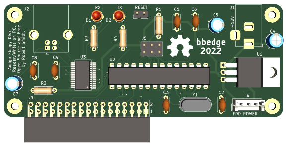

### Amiga-floppy-rw

По [мотивам](https://amiga.robsmithdev.co.uk/) Robert Smith. Проект основан на базе Arduino и USB-UART преобразователе.

В данном проекте, Arduino-mini и USB-AUST размещены на одной плате. Также на плате размещен разъем для подключения дисковода 3.5".

Контроллер на базе ATmega328P и программы DrawBridge позволяет:
- Записывать дискеты для Amiga из образов в формате adf на вашем Windows PC,
- Считывать дискеты Amiga и сохранять их в образы в формате adf.

### BOM

| Обозначение | Кол-во | Значение |
|-------------| --- | --- |
|C1, C6, C8, C9|4| 0.1uF |
|C2, C3	15p|	2| 15pF |
|C4, C5, C7|	3| 10uF |
| D1	|	1| LED 3mm |
| D2	|	1| LED 3mm |
| J1	|	1| Barrel Jack |
| J2	|	1| USB_B |
| J3	|	1| PinSocket_2x17_P2.54mm |
| J4	|	1| FDD POWER |
| J5	|	1| PinHeader_2x03_P2.54mm |
| R1	|	1| 10K |
| R2	|	1| 1K |
|R3, R4	|	2| 1,5K |
| SW1	|	1| PinHeader_1x02_P2.54mm |
| U1	|	1| LM2940-5.0 |
| U2	|	1| ATmega328P DIP 28W |
| U3	|	1| FT232RL SSOP-28 |
| Y1	|	1| 16MHz HC49-4H |

 
[Схема]: images/Схема.png
[PCB]: images/pcb.png
[3d-board]: images/3D-pcb.png